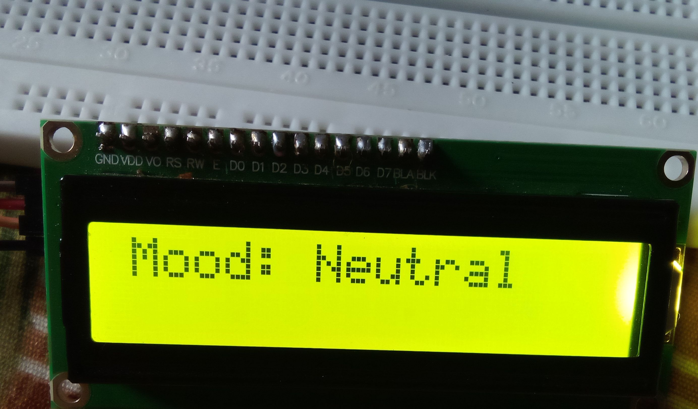
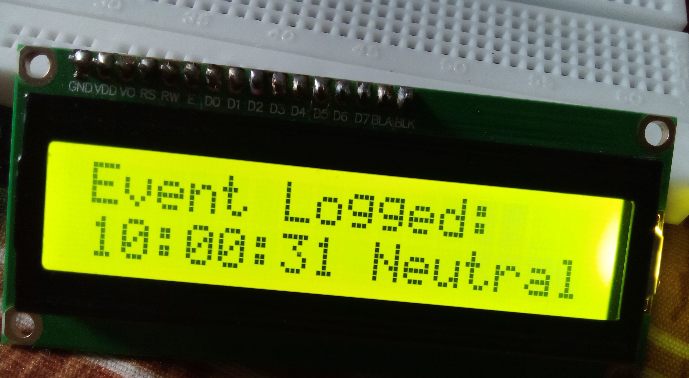
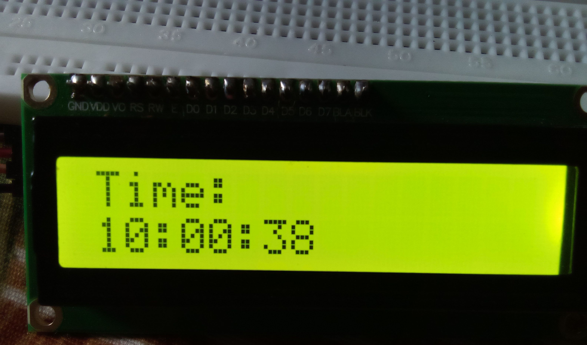

# Offline Mood & Event Logger using STM32F411RE

This project is a **standalone embedded system** that logs moods and events with timestamps using an STM32F411RE microcontroller, a bit-banged I2C LCD, and two GPIO buttons. It includes a **software RTC** for timekeeping.

## 📷 Demo Screens

| Mood Display | Event Logged | Time Display |
|--------------|--------------|--------------|
|  |  |  |

---

## 💡 Features

- Bit-banged I2C communication with a 16x2 LCD
- Two-button control using GPIO:
  - **PA6** – Toggle between moods (Happy/Sad/Neutral)
  - **PA5** – Log current time and mood as an event
- Software RTC for time tracking (without DS1307 or EEPROM)
- Displays:
  - Current mood
  - Logged event with time
  - Current time (updated every second)

---

## 🔧 Components Used

| Component               | Description              |
|------------------------|--------------------------|
| STM32F411RE            | Nucleo Board             |
| I2C 16x2 LCD           | Display                  |
| Push Buttons (2x)      | Mood Select / Log Event  |
| Breadboard + Wires     | Basic connections        |

---

## 🔌 Pin Configuration

| Signal       | STM32 Pin |
|--------------|-----------|
| I2C SDA      | PA9       |
| I2C SCL      | PA8       |
| Mood Select  | PA6       |
| Log Event    | PA5       |

---

## 🛠️ Setup & Build

1. Open the project in **STM32CubeIDE**.
2. Ensure the correct board is selected (STM32F411RE).
3. Connect your LCD and buttons according to the pin config.
4. Build and flash to your board.

---

## 🧠 Code Structure

- `main.c`: All logic for:
  - I2C communication (bit-banging)
  - LCD control
  - Software RTC
  - Button debouncing
  - Mood toggle and event logging

---

## 🚀 Output Sample

```
Mood: Happy

Event Logged:
10:22:33 Happy

Time:
10:22:34
```

---

## 📂 License

This project is open-source under the MIT License.

---
